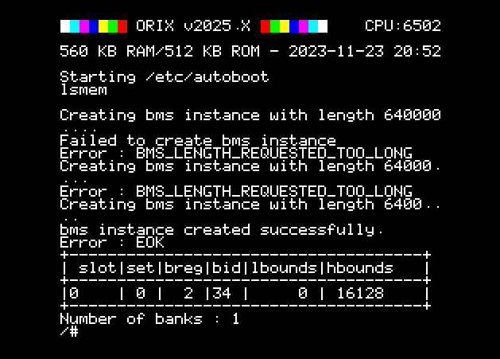

# BMS : bank management system

It's a cc65 library for Orix in order to manage bank on twilighte board.

It only manage ram bank.

## Versions

* [2025.4 documentation](2025.4/index.md)
* [2025.3 documentation](2025.3/index.md)
